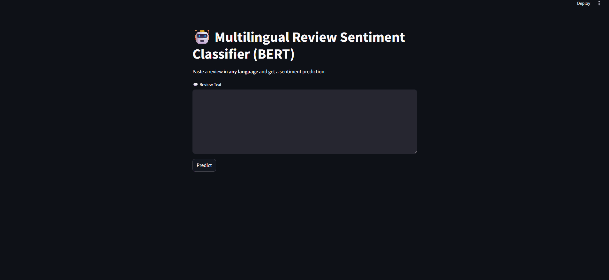

# 🧠 Multilingual Amazon Review Sentiment Classifier (BERT)

This project showcases a full-stack **NLP pipeline** to classify customer reviews into **positive** or **negative** sentiment — even if the review is written in **any language**.

Built with:
- 🤗 `transformers` and `BERT` for sentiment modeling
- 🌍 `deep-translator` for multilingual input support
- 📊 `Streamlit` for a user-friendly interactive app

---

## 📦 Features

- 💬 Accepts user reviews in **any language**
- 🔁 Automatically translates non-English text to English
- 🔍 Fine-tuned **BERT** model for sentiment prediction
- 🎯 High-confidence predictions with probability score
- 📊 Clean and modern dashboard UI
- 🎥 GIF demo included to preview app behavior

---

## 🚀 Demo Preview



---

## 📁 Project Structure

```
.
├── data/                      # Raw & processed datasets
├── dashboard/
│   ├── app_predictor_bert.py                 # English-only BERT app
│   ├── app_predictor_bert_multilingual.py    # Multilingual BERT app
│   └── bert_sentiment_model/                 # Fine-tuned BERT model
├── models/                    # (Optional) saved model binaries
├── scripts/
│   └── train_bert.py          # Model training script
├── demo.gif                   # App behavior GIF
├── README.md
└── requirements.txt
```

---

## 🧪 Example Prediction

**Input** (French):
> _"Bon produit même si le goût est moins prononcé... J'ai changé de marque à cause de cela."_

**Auto-translated**:
> _"Good product even if the taste is less pronounced... I changed brand because of this."_

**Prediction**:
> ⚠️ Negative Review (99.4% confidence)

---

## 🔧 Installation

```bash
git clone https://github.com/your-username/multilingual-bert-sentiment.git
cd multilingual-bert-sentiment

pip install -r requirements.txt
```

---

## 🖥️ Run the App

```bash
streamlit run dashboard/app_predictor_bert_multilingual.py
```

---

## 📚 Dataset

Dataset: [Datafiniti Amazon Consumer Reviews](https://www.kaggle.com/datasets/datafiniti/consumer-reviews-of-amazon-products)

Used subset: `Datafiniti_Amazon_Consumer_Reviews_of_Amazon_Products_May19.csv`

---

## 👨‍💻 Author

**Talel Taieb**  
Data Analyst  
[LinkedIn](https://www.linkedin.com/in/talel-taieb)

---


## 📄 License

MIT License.
